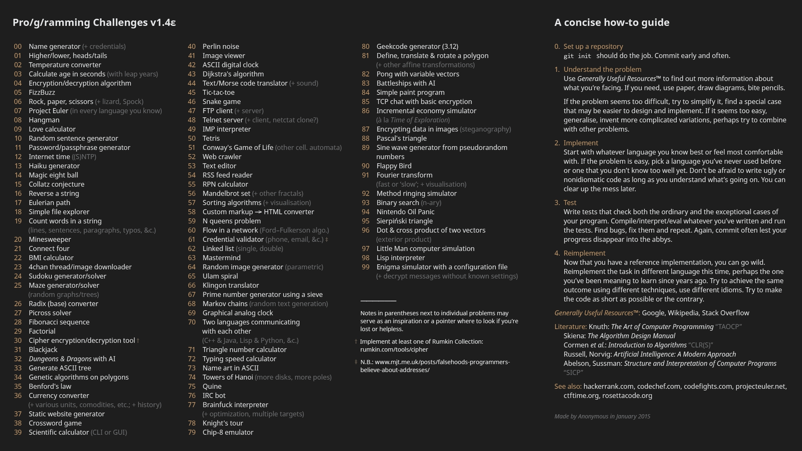

# Pro/g/ramming Challenges
> This is a collection of programming challenges that I am attempting to complete in python. The completed scripts are hosted on this repo. If you have any optimization suggestions, you can file an issue

>*fyi I did not make this image, I found it*

## Explanation of each script:
- **00 - Name Generator:** Generates a random name from an array of options
- **01 - Higher Lower:** Higher or lower game. Generates random number and you have to guess it using the program's hints
- **02 - Temp Converter:** Simply converts between Fahrenheit and Celsius
- **21 - Connect Four:** Connect four game. Includes empty answer protection
- **23 - Image Board Media Downloader:** Downloads images from a certain \*chan site
